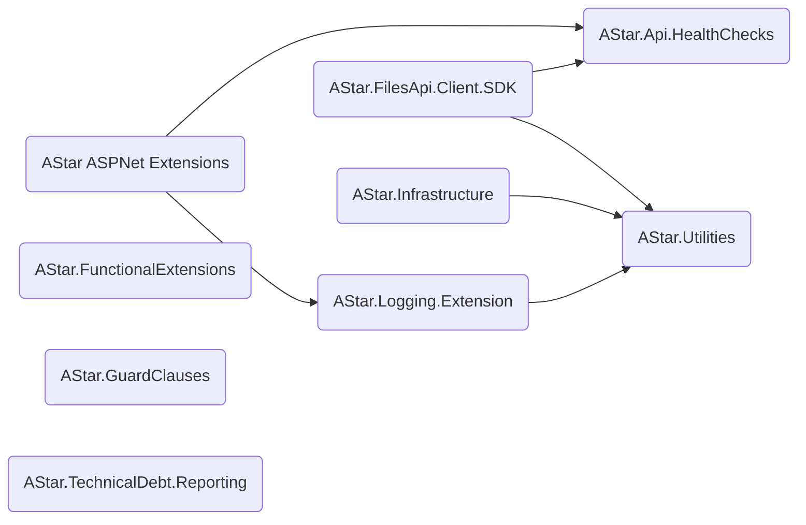

[AStar.Utilities](https://github.com/jbarden/astar-infrastructure/blob/main/README.md)

[AStar.FilesApi.Client.SDK](https://github.com/jbarden/astar-filesapi-client-sdk/README.md)

[AStar.Logging.Extensions](https://github.com/jbarden/astar-logging-extensions/README.md)

[AStar.Api.HealthChecks](https://github.com/jbarden/astar-api-healthchecks/README.md)

[AStar.ASPNet.Extensions](https://github.com/jbarden/astar-aspnet-extensions/README.md)

[AStar.GuardClauses](https://github.com/jbarden/astar-guardclauses/README.md)

[AStar.Infrastructure](https://github.com/jbarden/astar-infrastructure/README.md)

[AStar.FunctionalExtensions](https://github.com/jbarden/astar-functionalextensions/README.md)

[AStar.TechnicalDebt.Reporting](https://github.com/jbarden/astar-technicaldebt-reporting/README.md)
